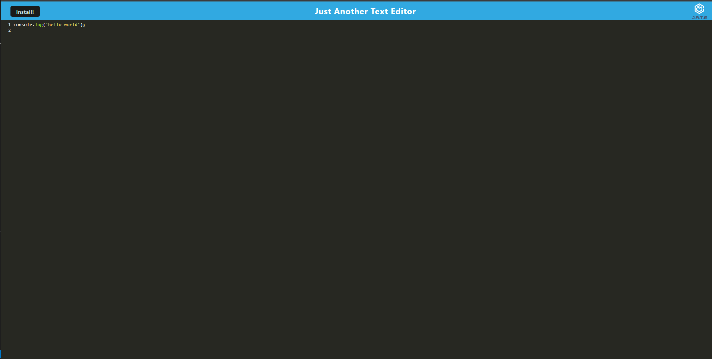

# Text Editor Starter Code

## Description
- My motivation for this project was to create a working text editor that can also work offline.
- I built this project using JavaScript and Webpack.
- I learned from making this application how to use webpack and service workers.

## Installation
- Enter 'npm install' then 'npm run start' to get the application started.

## Usage
- This app runs in the browser and offline.

## Credits
N/A

## License
MIT
